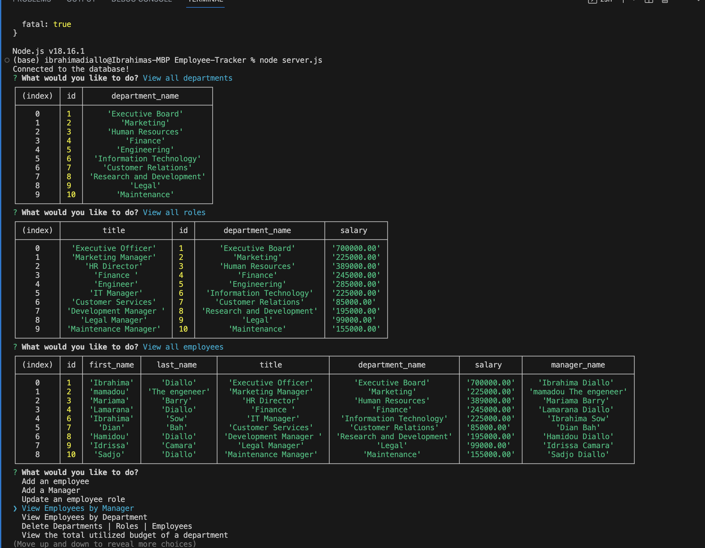

# Employee-Tracker

## Description 
This project was created for a Business owner so that they will  able to view and manage the departments, roles, and employees in the company, so that they can organize and plan the business. They can add, update and delete an employee. They can view all employees, departments and role and be able to delete, add or update.

## Technologies Used.
This app was build using JavaScript, MYsql2, database, Inquirer packages and Nodejs.

## Screenshot

## Here is a walkthrough video demonstrating the functionality of the application.

[CLICK HERE !!] ()

